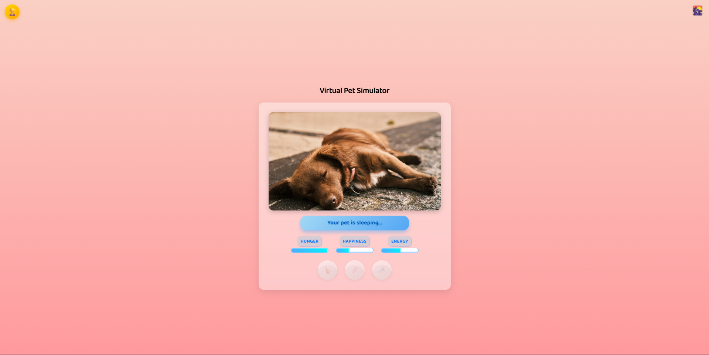
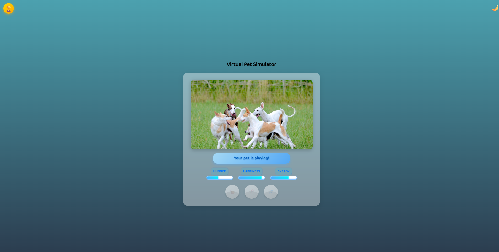
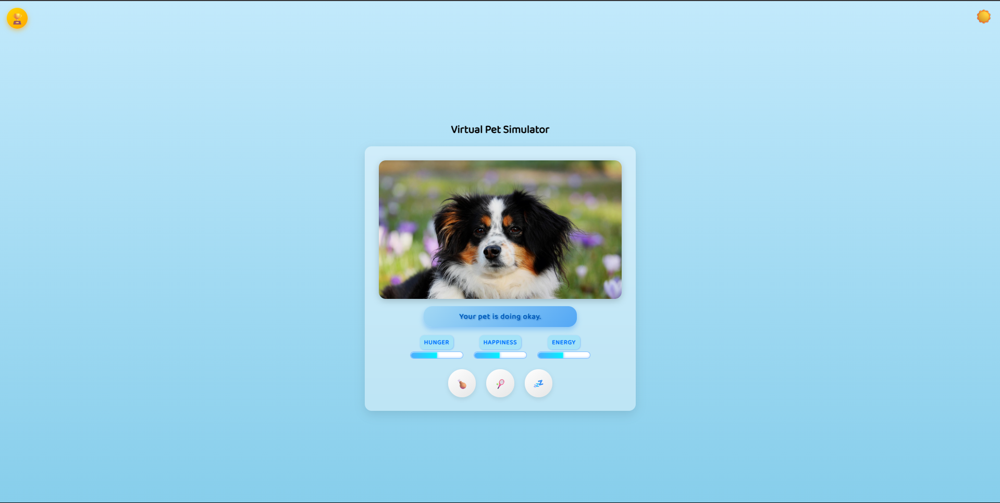

# 🐶 Virtual Pet Simulator

A fun and interactive **Virtual Pet Simulator** built with HTML, CSS, and JavaScript. Keep your pet happy, fed, and energized — or face the consequences.


## 🌟 Features

- 🐾 **Interactive Pet**: Feed, play, and put your pet to sleep.
- 🎨 **Day-Night Cycle**: Dynamic time-of-day visuals that affect pet behavior.
- 📊 **Live Stats**: Real-time bars for hunger, happiness, and energy.
- 🏆 **Achievements System**: Unlock and claim rewards by caring for your pet.
- ⚠️ **Game Over Logic**: Neglect your pet and suffer the adorable consequences.


## 🚀 How to Use

1. **Clone the repository:**

   ```bash
   git clone https://github.com/yourusername/virtual-pet-simulator.git
   cd virtual-pet-simulator
2. Open index.html in any browser.

No build tools or server required — it's 100% client-side.

## 🧠 Game Logic
Attributes:
- Hunger increases over time.
- Happiness decreases unless played with.
- Energy depletes unless pet sleeps.

Time Phases:
- Day, Evening, and Night cycles every 10 seconds.
- Each phase affects how stats change (e.g. slower energy loss at night).

Achievements:
- Earn rewards like stat boosts by performing actions multiple times.
- Track and claim achievements via the 🏆 button.

Game Over:
- Pet dies if Hunger ≥ 100, Happiness ≤ 0, or Energy ≤ 0.

## 🎮 Controls

- 🍗:	Feed the pet
- 🎾:	Play with the pet
- 💤:	Put the pet to sleep
- 🏆:	View Achievements

## 📸 Screenshots
> 
> 
> 

## 🛠 Tech Stack
- HTML5
- CSS3
- Vanilla JavaScript
- No frameworks. No dependencies. Pure frontend.

## 💡 Credits
- Images from Pixabay
- Fonts from Google Fonts - Baloo 2

## 📜 License
This project is open-source and available under the MIT License.
